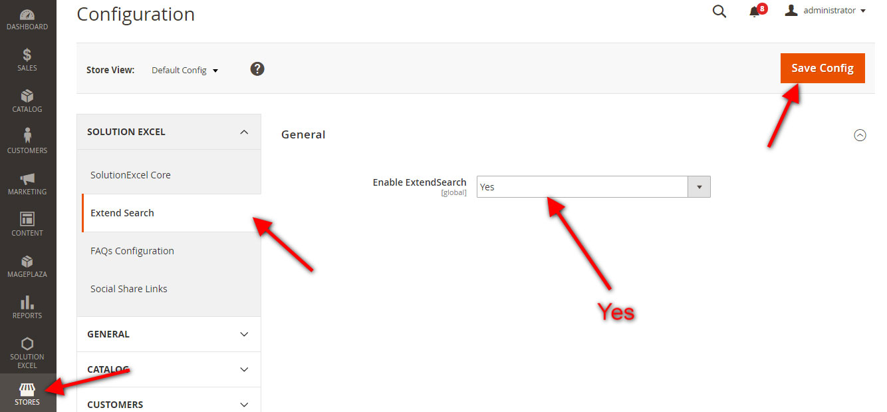

# Magento 2 Extend Search Extension (free)
Magento 2 Extension extend search extension provide functionality for search, user input keyword that have in any position in product name and sku.

#### Compatible With:
Magento ver 2.2.2

## Available Features:
* Find user input keywork in any any position in product name and sku
* Apply query with pattern LIKE "%keyword%"
* Menu Contiguration: SOLUTION EXCEL => Configure ExtendSearch
* Enable/Disable: STORE => SOLUTION EXCEL => Extend Search. Set value of Enable ExtendSearch to Yes and Save Config

## Extend Search system config setting

## Extend Search frontend screen shot

## Installation
##### Manually (not recommended)
 * Download Reindex Extension
 * Unzip the magento2-extend-search-master.zip file
 * Create a folder {Magento 2 root}/app/code/Solutionexcel
 * Copy all folder (Core and ExtendSearch) to Solutionexcel folder

#### Step 2 - Enable/Install via command line
 * php bin/magento module:enable Solutionexcel_Core
 * php bin/magento module:enable Solutionexcel_ExtendSearch
 * php bin/magento setup:upgrade
 * php bin/magento cache:flush

If you have any inquiry please contact with me via email or skype.
* Email: [info@solutionexcel.com](mailto:info@solutionexcel.com)
* Skype: solutionexcel
* Web: [Solution Excel](https://www.solutionexcel.com/)

